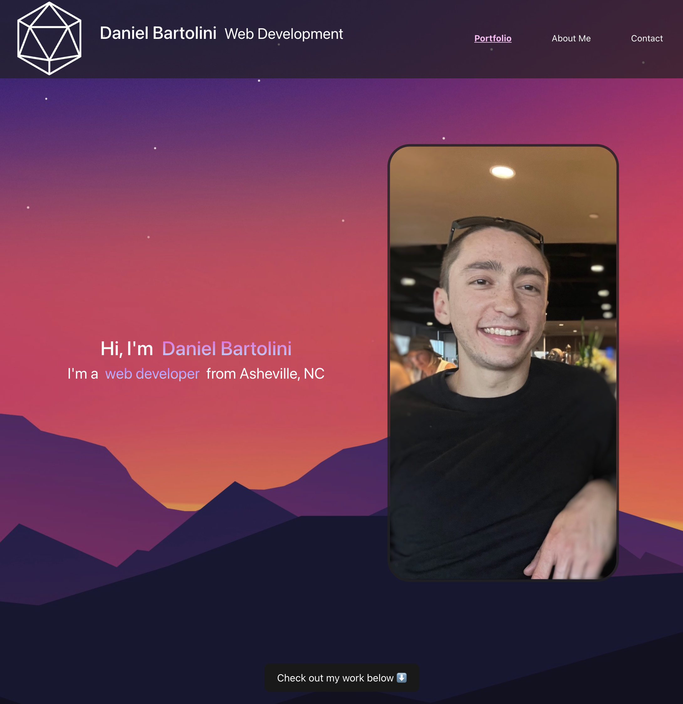

# Daniel Bartolini - Portfolio

[Click Here to Access Live App](https://djbartolini.github.io/portfolio/)

My name is Daniel Bartolini, and this is my portfolio! It was made using React.JS and React Router, deployed through GH-pages. I hope you enjoy. I will be expanding upon it in the near future.

Current and upcoming projects include:
- Full-stack real estate web app for Dan Bartolini, an NC realtor - and also my dad!

Featured apps:
- [Let's Get Quizzical](https://young-fortress-52703.herokuapp.com/)
- [Sofa King Cool](https://young-fortress-52703.herokuapp.com/)
- [Tech About It](https://tech-about-it-blog.herokuapp.com/)

## Table of Contents
  * [Usage](#usage)
  * [Contriuting](contributing)
  * [License](#license)
  * [Support](support)

## Usage
Visit [this link](https://djbartolini.github.io/portfolio/) to access my portfolio. Each app listed in the portfolio is a clickable link that will redirect you to that app. There is a contact form if you would like to contact me. Thank you!

## Contibuting
This app was made using:
* [React](https://reactjs.org/)
* [Vite](https://vitejs.dev/)
* [Node.js](https://nodejs.org/en/)
* [React Router](https://reactrouter.com/en/main)
* [React Scroll Motion](https://www.npmjs.com/package/react-scroll-motion)
* [tsparticles](https://particles.js.org/)
* [Bootstrap](https://getbootstrap.com/)
* [Font Awesome](https://fontawesome.com/)

## License
This app is covered under the MIT license: [MIT](https://opensource.org/licenses/MIT)

## Support  
If you encounter problems with the website, please reach out to me on [GitHub](https://github.com/djbartolini), contact me through the form on the website, or email me at daniel@bartolini.dev.
